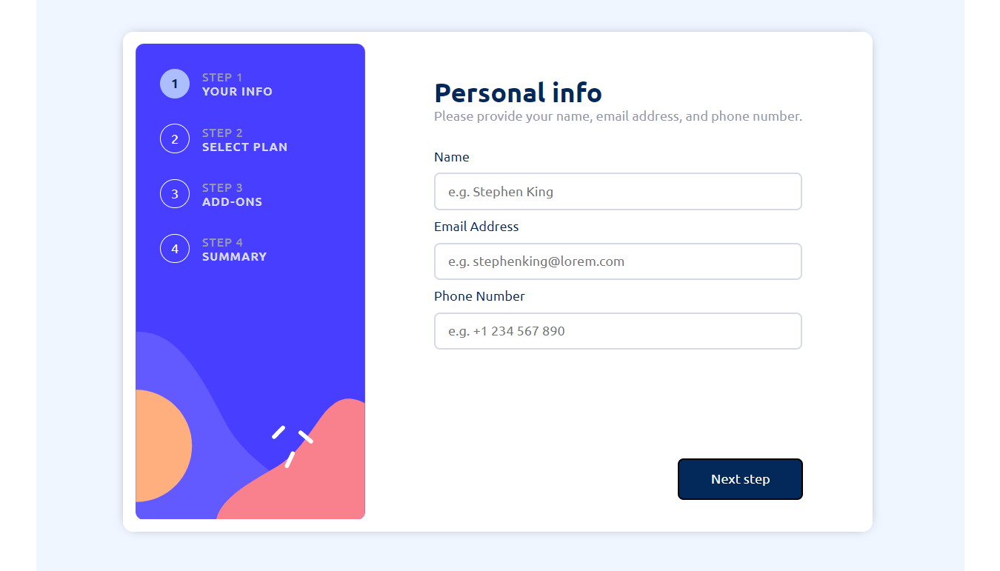

# Frontend Mentor - Multi-step form solution

This is a solution to the [Multi-step form challenge on Frontend Mentor](https://www.frontendmentor.io/challenges/multistep-form-YVAnSdqQBJ). Frontend Mentor challenges help you improve your coding skills by building realistic projects. 

## Table of contents

- [The challenge](#the-challenge)
- [Screenshot](#screenshot)
- [Links](#links)
- [My process](#my-process)
- [Built with](#built-with)
- [What I learned](#what-i-learned)
- [Useful resources](#useful-resources)
- [Acknowledgments](#acknowledgments)

**Note: Delete this note and update the table of contents based on what sections you keep.**

### The challenge

Users should be able to:

- Complete each step of the sequence
- See a summary of their selections on the final step and confirm their order
- View the optimal layout for the interface depending on their device's screen size
- See hover and focus states for all interactive elements on the page

### Screenshot

### Links
- Live Site URL: [Add live site URL here](https://multi-step-form.onrender.com/)

## My process
0) Setup 
1) Make HTML 
2) Add style 
3) Add JS switch between cards and validate form  
4) Add Animation

### Built with

- Semantic HTML5 markup
- CSS custom properties
- Flexbox
- CSS Grid
- Vanilla JS 

### What I learned

All my life I've been lied, check-box sign for real is border without 2 sides.

If you don't add type of button and you press it then your site will be refresh.

custom radio-buttons

custom checkboxes 

stock with get value from radio buttons 

destructuring HTML elements by using spread operator 

### Useful resources

- [How TO - Toggle Switch](https://www.w3schools.com/howto/howto_css_switch.asp) - This helped me create castome check-box-switch
- [Can I Create This Complex Animated Multi-step Form?](https://www.youtube.com/watch?v=VdqtdKXxKhM&list=LL&index=7&t=1328s) - This is an amazing tutorial which helped me finally understand how to build system to switch between views. I'd recommend it to anyone still learning this concept.

- [stackoverflow](https://stackoverflow.com/questions/11599666/get-the-value-of-checked-checkbox)

## Acknowledgments

Thank God